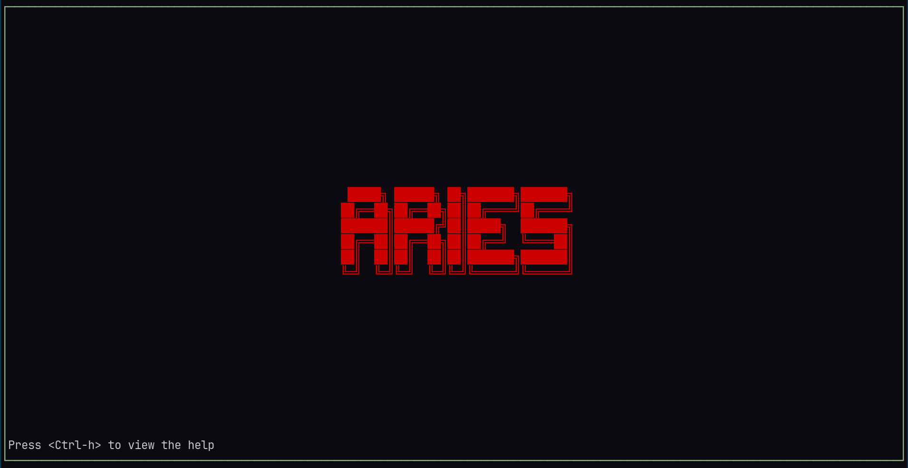
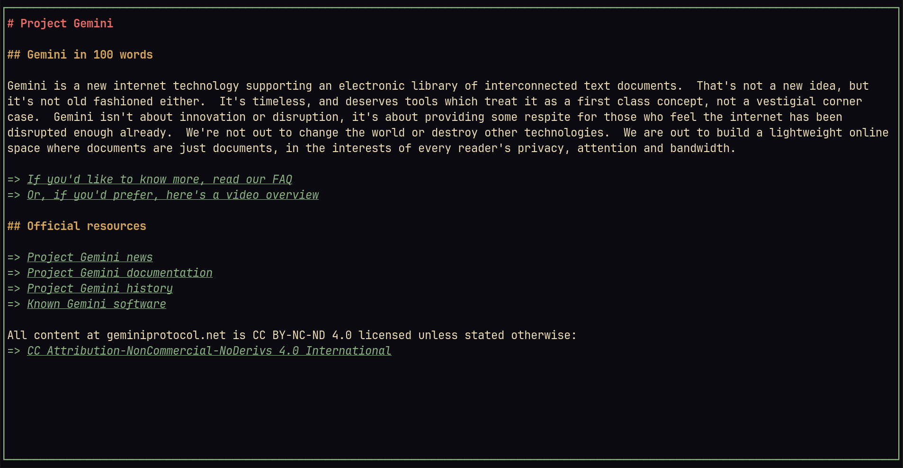

# ARIES

This is a tui browser for the [gemini protocol](https://en.wikipedia.org/wiki/Gemini_(protocol)).



# Installation

> [!WARNING]
> This has been tested and used only on linux.

```bash
git clone --depth=1 https://github.com/chachacollins/aries
cd aries
cargo build --release
cp ./target/release/aries $INSTALFOLDER
```

# Help and Documentation

To view the help page just press ctrl + h while anywhere in the browser.

# License

This project is under public domain. See more here [Unlicense license](./LICENSE).
